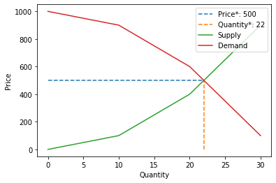

# graphs_for_economics

<!-- WARNING: THIS FILE WAS AUTOGENERATED! DO NOT EDIT! -->

This file will become your README and also the index of your
documentation.

## Install

``` sh
pip install graphs_for_economics
```

## How to use

``` python
graph = Graph_free_market()
supply_function = " x**2"
demand_function = "1000 -  x**2"
```

``` python
consumer_surplus = graph.get_consumer_surplus(supply_function, demand_function)
print("Consumer Surplus:", consumer_surplus)

producer_surplus = graph.get_producer_surplus(supply_function, demand_function)
print("Producer Surplus:", producer_surplus)

economic_surplus = graph.get_economic_surplus(supply_function, demand_function)

print("Economic Surplus:", economic_surplus)
```

    Consumer Surplus: 7451
    Producer Surplus: 18454
    Economic Surplus: 25905

``` python
graph.market_graph(supply_function, demand_function,0, 40, 10, complete=True)
```



``` python
price = graph.get_price(supply_function, demand_function)
quantity = graph.get_quantity(supply_function, demand_function)
print(f"Price: {price}, Quantity: {quantity}")
```

    Price: 500, Quantity: 22
